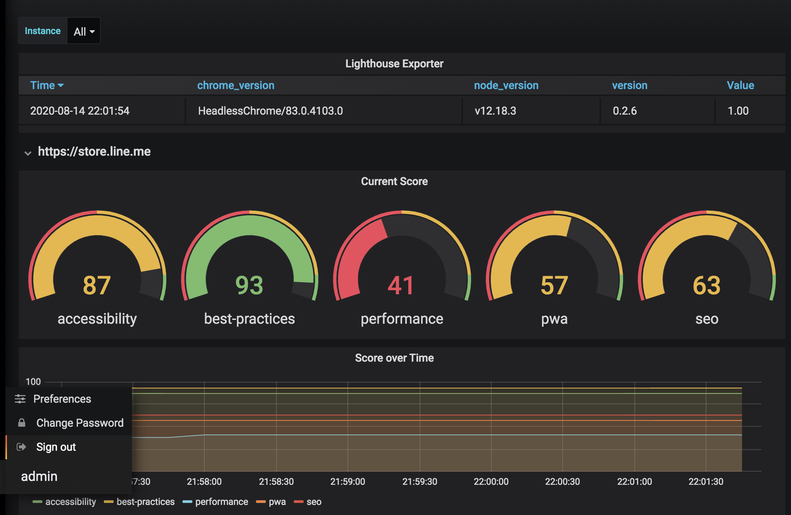

# Lighthouse reports dashboard on Prometheus and Grafana.



## Middleware
* Prometheus
* Grafana
* Docker
* Prometheus Lighthouse Exporter (copy from [here](https://github.com/pkesc/prometheus_lighthouse_exporter))

## How to build.

### Run applications.

```
$ docker-compose up -d 
```

### Create dashboard on Grafana.

1. Access to Grafana "http://localhost:3000/".
1. Log in (ID: admin password: admin)
1. Add dara source.
    - Name : Prometheus
    - URL : http://host.docker.internal:9090
    - HTTP Method : GET 
1. Import dasgboard.
    - Select "Upload .json file" 
    - Choose "prometheus_lighthose_exporter-master/grafana_dashboard.json"

### References
* Prometheus : http://localhost:9090/
* Exporter: http://localhost:9593/probe?target=https://store.line.me
